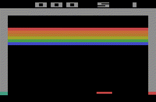

<div align="center"></div>

# ChainerRL
[](https://travis-ci.org/pfnet/chainerrl)
[](https://coveralls.io/github/pfnet/chainerrl)
[](http://chainerrl.readthedocs.io/en/latest/?badge=latest)
[](https://pypi.python.org/pypi/chainerrl)

ChainerRL is a deep reinforcement learning library that implements various state-of-the-art deep reinforcement algorithms in Python using [Chainer](https://github.com/pfnet/chainer), a flexible deep learning framework.




## Installation

ChainerRL is tested with Python 2.7+ and 3.5.1+. For other requirements, see [requirements.txt](requirements.txt).

ChainerRL can be installed via PyPI:
```
pip install chainerrl
```

It can also be installed from the source code:
```
python setup.py install
```

Refer to [Installation](http://chainerrl.readthedocs.io/en/latest/install.html) for more information on installation. 

## Getting started

You can try [ChainerRL Quickstart Guide](examples/quickstart/quickstart.ipynb) first, or check the [examples](examples) ready for Atari 2600 and Open AI Gym.

For more information, you can refer to [ChainerRL's documentation](http://chainerrl.readthedocs.io/en/latest/index.html).

## Algorithms

| Algorithm | Discrete Action | Continous Action | Recurrent Model | CPU Async Training |
|:----------|:---------------:|:----------------:|:---------------:|:------------------:|
| DQN (including DoubleDQN etc.) | ✓ | ✓ (NAF) | ✓ | x |
| DDPG | x | ✓ | ✓ | x |
| A3C | ✓ | ✓ | ✓ | ✓ |
| ACER | ✓ | ✓ | ✓ | ✓ |
| NSQ (N-step Q-learning) | ✓ | ✓ (NAF) | ✓ | ✓ |
| PCL (Path Consistency Learning) | ✓ | ✓ | ✓ | ✓ |

Following algorithms have been implemented in ChainerRL:
- A3C (Asynchronous Advantage Actor-Critic)
- ACER (Actor-Critic with Experience Replay)
- Asynchronous N-step Q-learning
- DQN (including Double DQN, Persistent Advantage Learning (PAL), Double PAL, Dynamic Policy Programming (DPP))
- DDPG (Deep Deterministic Poilcy Gradients) (including SVG(0))
- PGT (Policy Gradient Theorem)
- PCL (Path Consistency Learning)

Q-function based algorithms such as DQN can utilize a Normalized Advantage Function (NAF) to tackle continuous-action problems as well as DQN-like discrete output networks.

## Environments

Environments that support the subset of OpenAI Gym's interface (`reset` and `step` methods) can be used.

## Contributing

Any kind of contribution to ChainerRL would be highly appreciated! If you are interested in contributing to ChainerRL, please read [CONTRIBUTING.md](CONTRIBUTING.md).

## License

[MIT License](LICENSE).
