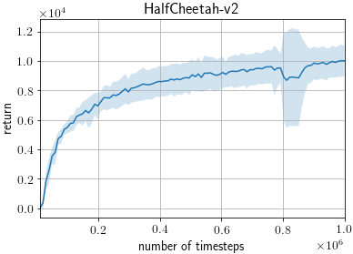
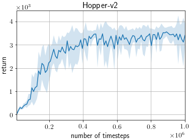
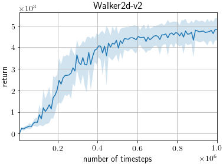
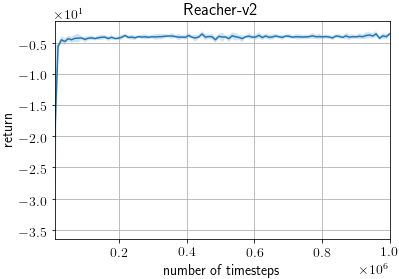
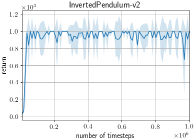
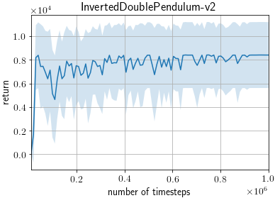

# TD3 on MuJoCo benchmarks

This example trains a TD3 agent ([Addressing Function Approximation Error in Actor-Critic Methods](http://arxiv.org/abs/1802.09477)) on MuJoCo benchmarks from OpenAI Gym.

## Requirements

- MuJoCo Pro 1.5
- mujoco_py>=1.50, <2.1

## Running the Example

```
python train_td3.py [options]
```

### Useful Options

- `--gpu`. Specifies the GPU. If you do not have a GPU on your machine, run the example with the option `--gpu -1`. E.g. `python train_td3.py --gpu -1`.
- `--env`. Specifies the environment. E.g. `python train_td3.py --env HalfCheetah-v2`.
- `--render`. Add this option to render the states in a GUI window.
- `--seed`. This option specifies the random seed used.
- `--outdir` This option specifies the output directory to which the results are written.

To view the full list of options, either view the code or run the example with the `--help` option.

## Known differences

- While the original paper used different numbers of timesteps for which purely random policy is used for different environments (10000 for HalfCheetah and Ant, 1000 for the remaining), we used 10000 across all the environments.
- While [the original implementation](https://github.com/sfujim/TD3) updates the model N times after every episode where N is the length of the episode, our implementation updates the model once every step. In addition, ours does not update the model until the replay buffer has at least 10000 transitions.

## Results

ChainerRL scores are based on 10 trials using different random seeds, using the following command.

```
python train_td3.py --seed [0-9] --env [env]
```

During each trial, the agent is trained for 1M timesteps and evaluated after every 5000 timesteps, resulting in 200 evaluations.
Each evaluation reports average return over 10 episodes without exploration noise.

### Max Average Return

Maximum evaluation scores, averaged over 10 trials (+/- standard deviation), are reported for each environment.

Reported scores are taken from the "TD3" column of Table 1 of [Addressing Function Approximation Error in Actor-Critic Methods](http://arxiv.org/abs/1802.09477).
Although the original paper used v1 versions of MuJoCo envs, we used v2 as v1 are not supported by recent versions of OpenAI Gym.

| Environment               | ChainerRL Score        | Reported Score        |
| ------------------------- |:----------------------:|:---------------------:|
| HalfCheetah-v2            | **10248.51**+/-1063.48 |     9636.95+/-859.065 |
| Hopper-v2                 |   **3662.85**+/-144.98 |      3564.07+/-114.74 |
| Walker2d-v2               |   **4978.32**+/-517.44 |      4682.82+/-539.64 |
| Ant-v2                    |  **4626.25**+/-1020.70 |     4372.44+/-1000.33 |
| Reacher-v2                |       **-2.55**+/-0.19 |          -3.60+/-0.56 |
| InvertedPendulum-v2       |     **1000.00**+/-0.00 |    **1000.00**+/-0.00 |
| InvertedDoublePendulum-v2 |      8435.33+/-2771.39 |   **9337.47**+/-14.96 |


### Last 100 Average Return

Average return of last 10 evaluation scores, averaged over 10 trials, are reported for each environment.

Reported scores are taken from the "TD3" row of Table 2 of [Addressing Function Approximation Error in Actor-Critic Methods](http://arxiv.org/abs/1802.09477).
Although the original paper used v1 versions of MuJoCo envs, we used v2 as v1 are not supported by recent versions of OpenAI Gym.

| Environment               | ChainerRL Score | Reported Score |
| ------------------------- |:---------------:|:--------------:|
| HalfCheetah-v2            |     **9952.04** |        9532.99 |
| Hopper-v2                 |     **3365.24** |        3304.75 |
| Walker2d-v2               |     **4705.46** |        4565.24 |
| Ant-v2                    |         4174.14 |    **4185.06** |
| Reacher-v2                |           -3.89 |            N/A |
| InvertedPendulum-v2       |          908.70 |            N/A |
| InvertedDoublePendulum-v2 |         8372.44 |            N/A |

### Training times


| Game        | ChainerRL Time           |
| ------------- |:-------------:|
| Ant | 4.11 hours |
| HalfCheetah | 3.758 hours |
| Hopper | 4.215 hours |
| InvertedDoublePendulum | 3.567 hours |
| InvertedPendulum | 3.62 hours |
| Reacher | 3.642 hours |
| Walker2d | 3.632 hours |


| Statistic        |            |            |
| ------------- |:-------------:|:-------------:|
| Mean time (in hours) across all domains        |  3.792 |
| Fastest Domain |  InvertedDoublePendulum | 3.567 |
| Slowest Domain |  Hopper | 4.215 |


### Learning Curves

The shaded region represents a standard deviation of the average evaluation over 10 trials.








